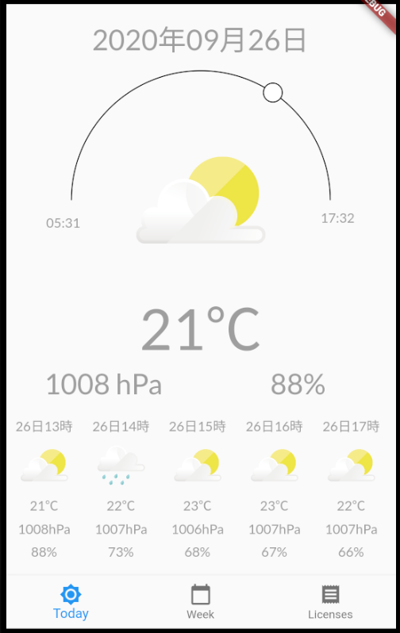
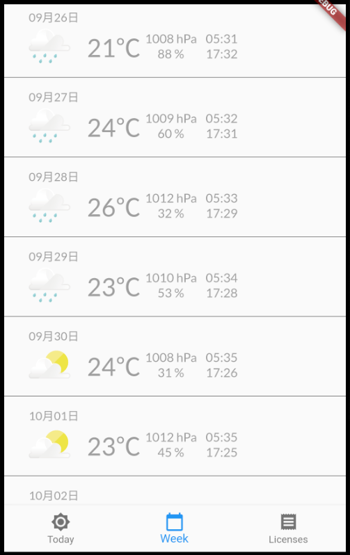
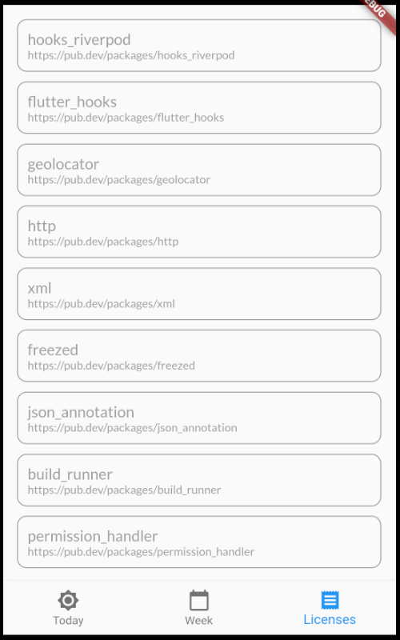

# flutter_otenki_app

* Flutterの勉強のために作成したお天気情報表示アプリ

# 概要
* アプリ開発に必要そうな機能になるべく触るように作りました
  * API通信
  * JSON/XMLのパース
  * リスト表示
  * 処理中のインジケータ表示
  * 画像表示

# 実装画面
|今日の天気|今週の天気|パッケージ一覧|
|:---:|:---:|:---:|
||||